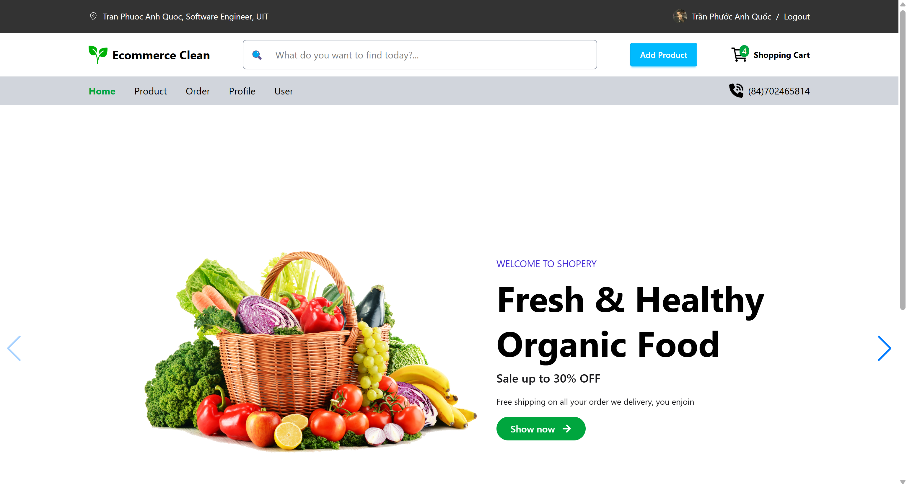
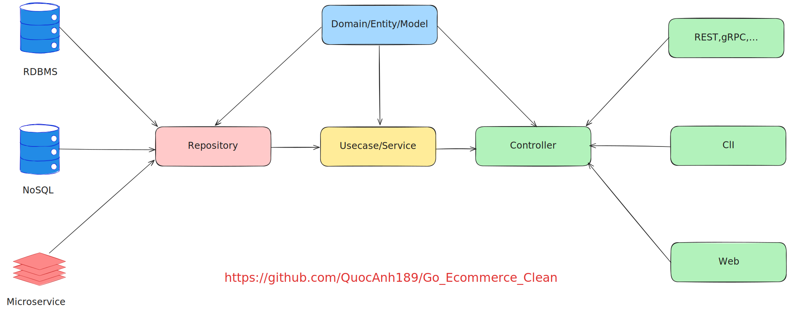
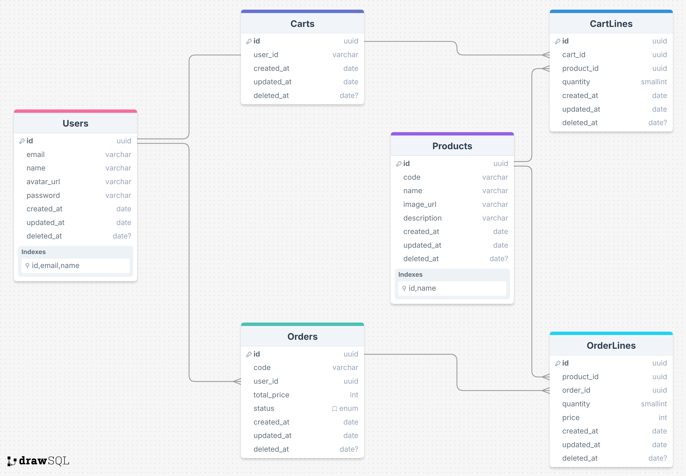
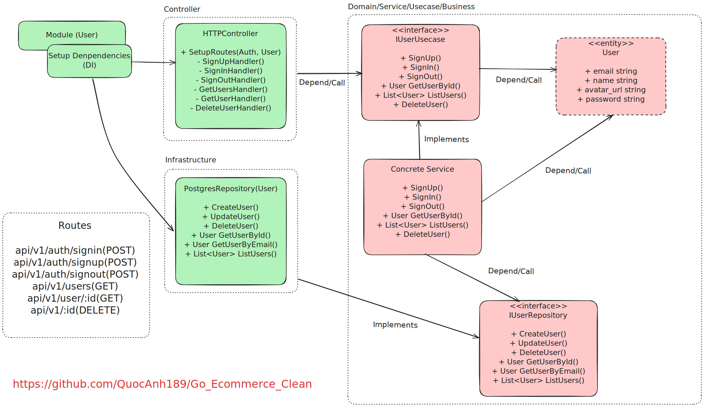
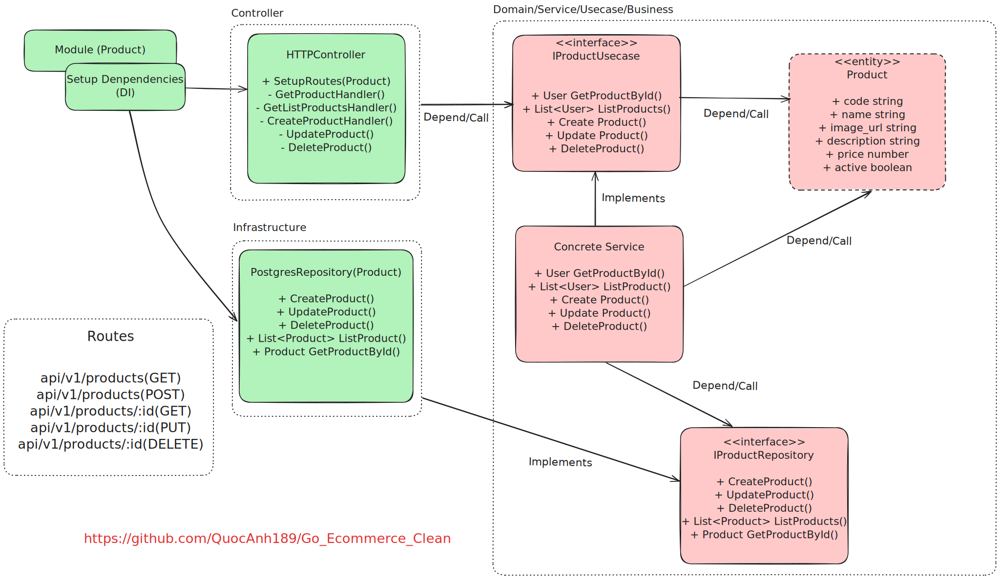
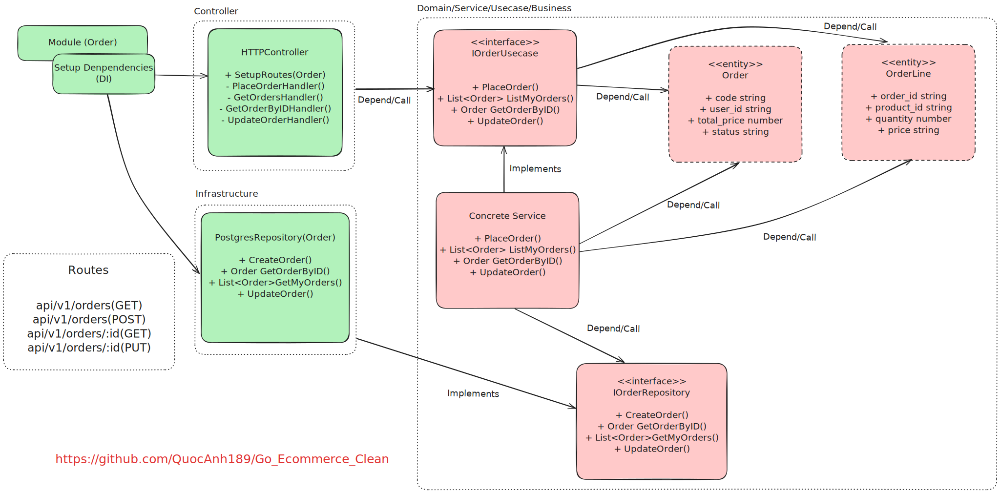
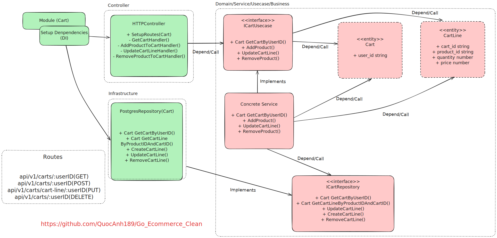
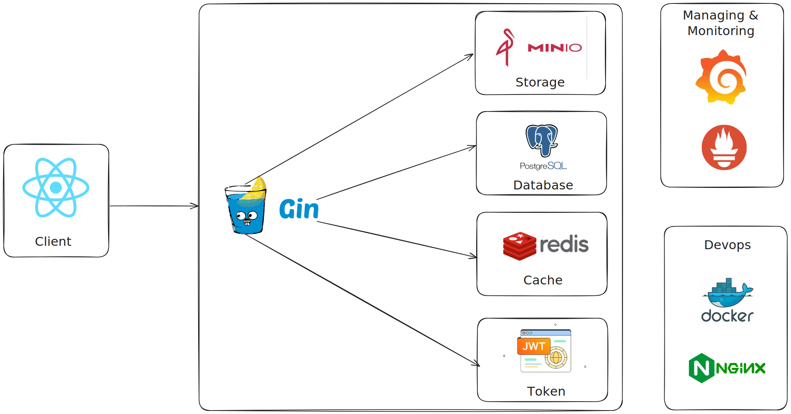

# Go-Ecommerce-Clean Architecture

## ⭐⭐⭐ Give Me Star

If this project is helpful to you, please consider giving it a star on GitHub. Contact with me if you have a question. 

## Overview

The purpose of the template is to show:

- how to organize a project and prevent it from turning into spaghetti code
- where to store business logic so that it remains independent, clean, and extensible
- how not to lose control when a project grows

Using the principles of Robert Martin (aka Uncle Bob).

## Demo

## Clean Architecture

## Database

## Clean Module
### User_Module

### Product_Module

### Order_Module

### Cart_Module

## Tech Stack

- [React](https://react.dev)
- [Restful API](https://docs.github.com/en/rest?apiVersion=2022-11-28)
- [Domain Driven Design](https://flowframework.readthedocs.io/en/stable/TheDefinitiveGuide/PartI/ConceptsOfModernProgramming.html)
- [Gin-gonic](https://github.com/gin-gonic/gin)
- [Gorm](https://github.com/go-gorm/gorm)
- [Swagger](https://github.com/swagger-api)
- [Logging](https://github.com/uber-go/zap)
- [Jwt-Go](https://github.com/golang-jwt/jwt)
- [Redis](https://github.com/redis/go-redis)
- [Minio](https://github.com/minio/minio-go)
- [Docker](https://www.docker.com/)
- [Nginx](https://nginx.org/)
- [Grafana](https://grafana.com/docs/grafana-cloud/monitor-infrastructure/integrations/integration-reference/integration-golang/)
- [Prometheus](https://github.com/prometheus/client_golang)

## Project Structure

### `cmd/app`

Entry point of the application. Responsible for initializing the configuration, setting up the logger, and starting the application.

### `configs`

Contains configuration files for different environments, such as database connections, API keys, and other application settings.

### `db`

Holds database-related files, including database setup and option function.

### `frontend`

Setup client for demo project.

### `docs`

Contains documentation files, API specifications, and related documentation resources.

### `internals`

This directory houses the core business logic of the application, divided into multiples modules

### `nginx`

Stores configuration files for Nginx

### `pkgs`

Contains reusable packages and utilities that can be shared across different parts of the project.

### `utils`

Includes utility functions and helper methods used throughout the project.

### `grafana`

Contains configuration files and dashboards for monitoring application metrics using Grafana.

### `prometheus`

Holds configuration files for Prometheus, which collects and stores metrics from the application for monitoring and alerting.

## How to run application (Docker)
1. Clone the repo and cd into it
2. Set mode `LF` (not `CRLF`) for entrypoint.sh file  
3. Run `docker-compose up --build -d` local dev environment
4. Setup minio container.
- Run `docker exect -it <container_id of ecommerce.minio> sh`.
- Run `mc alias set myminio http://ecommerce.minio:9000 minioadmin minioadmin123`.
- Run `mc anonymous set public myminio/ecommerce`.
5. Test api with BASE_URL is `http://localhost:8080/api/v1` or `http://app.lvh.me/api/v1`
6. If you want to demo with frontend on React, visit `http://localhost:8005` on browser.

## Reference projects

- [https://github.com/evrone/go-clean-template](https://github.com/evrone/go-clean-template)
- [https://github.com/bxcodec/go-clean-arch](https://github.com/bxcodec/go-clean-arch)

## Useful links

- [The Clean Architecture article](https://blog.cleancoder.com/uncle-bob/2012/08/13/the-clean-architecture.html)
- [Twelve factors](https://12factor.net/ru/)

## Author Contact

Contact me with any questions! 

Email: anquoc18092003@gmail.com
Facebook: https://www.facebook.com/tranphuocanhquoc2003

Thank You so much for your time !!!
